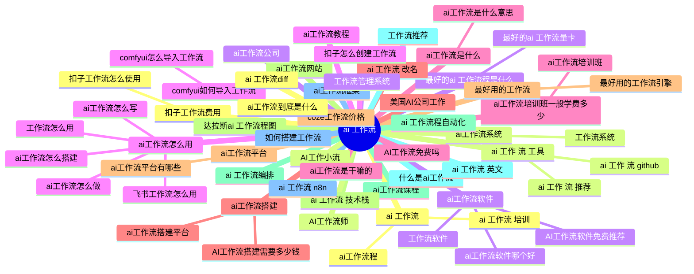

# Topic cluster map — `ai 工作流` (zh)

Generated 2026-09-16 · 60 keywords · 38 clusters · est. 4,037 searches/mo (heuristic)

Legend: **pillar** = cluster head (highest est. volume); satellites hang under it. `KD` 0–100 (lower = easier). `→` target page; `NEW` = no matching page yet.

## Clusters at a glance

| # | Cluster (pillar) | Keywords | Est. vol | Avg KD | Dominant intent | Target |
|---|---|---:|---:|---:|---|---|
| 1 | **ai 工作流** | 3 | 520 | n/a | informational | `/zh/ai-training/` |
| 2 | **ai 工作 流 工具** | 3 | 324 | n/a | commercial | `/zh/ai-training/` |
| 3 | **ai工作流软件** | 4 | 310 | n/a | commercial | `/zh/ai-training/` |
| 4 | **ai工作流怎么用** | 6 | 262 | n/a | informational | `/zh/ai-training/` |
| 5 | **ai工作流是什么** | 2 | 247 | n/a | informational | `/zh/about/` |
| 6 | **ai工作流搭建** | 3 | 238 | n/a | transactional | `/zh/about/` |
| 7 | **ai工作流平台** | 2 | 237 | n/a | commercial | `/zh/ai-training/` |
| 8 | **ai工作流网站** | 1 | 140 | n/a | commercial | `/zh/ai-training/` |
| 9 | **ai工作流课程** | 1 | 120 | n/a | informational | `/zh/ai-training/` |
| 10 | **什么是ai工作流** | 1 | 120 | n/a | informational | `/zh/about/` |
| 11 | **ai工作流框架** | 1 | 100 | n/a | commercial | `/zh/ai-training/` |
| 12 | **扣子工作流费用** | 2 | 84 | n/a | transactional | `NEW /zh/feiyong/` |
| 13 | **ai工作流系统** | 2 | 80 | n/a | commercial | `/zh/ai-training/` |
| 14 | **最好的ai 工作流程是什么** | 2 | 80 | n/a | informational | `/zh/about/` |
| 15 | **comfyui如何导入工作流** | 2 | 80 | n/a | informational | `NEW /zh/comfyui-ruhe/` |
| 16 | **ai工作流培训班一般学费多少** | 2 | 80 | n/a | informational | `/zh/ai-training/` |
| 17 | **ai 工作流 改名** | 1 | 77 | n/a | commercial | `/zh/ai-training/` |
| 18 | **最好用的工作流** | 2 | 72 | n/a | commercial | `/zh/ai-training/` |
| 19 | **ai 工作流 技术栈** | 1 | 71 | n/a | commercial | `/zh/ai-training/` |
| 20 | **ai 工作流编排** | 1 | 54 | n/a | commercial | `/zh/ai-training/` |
| 21 | **ai 工作流 英文** | 1 | 54 | n/a | commercial | `/zh/ai-training/` |
| 22 | **ai 工作流 n8n** | 1 | 54 | n/a | commercial | `/zh/ai-training/` |
| 23 | **ai 工作流diff** | 1 | 49 | n/a | commercial | `/zh/ai-training/` |
| 24 | **AI工作小流** | 1 | 42 | n/a | commercial | `/zh/ai-training/` |
| 25 | **ai工作流公司** | 1 | 42 | n/a | commercial | `/zh/about/` |
| 26 | **ai工作流教程** | 1 | 42 | n/a | informational | `/zh/ai-training/` |
| 27 | **AI工作流免费吗** | 1 | 42 | n/a | transactional | `/zh/ai-training/` |
| 28 | **美国AI公司工作** | 1 | 42 | n/a | commercial | `/zh/about/` |
| 29 | **coze工作流价格** | 1 | 42 | n/a | transactional | `NEW /zh/coze-jiage/` |
| 30 | **达拉斯ai 工作流程图** | 1 | 42 | n/a | informational | `/zh/ai-training/` |
| 31 | **ai 工作流程自动化** | 1 | 40 | n/a | informational | `/zh/ai-training/` |
| 32 | **工作流推荐** | 1 | 38 | n/a | commercial | `/zh/about/` |
| 33 | **如何搭建工作流** | 1 | 38 | n/a | transactional | `/zh/about/` |
| 34 | **ai工作流到底是什么** | 1 | 38 | n/a | informational | `/zh/about/` |
| 35 | **AI工作流师** | 1 | 34 | n/a | commercial | `/zh/ai-training/` |
| 36 | **工作流管理系统** | 1 | 34 | n/a | commercial | `NEW /zh/xitong/` |
| 37 | **扣子怎么创建工作流** | 1 | 34 | n/a | informational | `NEW /zh/zenme/` |
| 38 | **ai工作流是干嘛的** | 1 | 34 | n/a | commercial | `/zh/ai-training/` |

## Pillar → satellite tree

- **ai 工作流** · vol 300 · KD n/a · commercial → `/zh/ai-training/`
  - ai工作流程 · vol 160 · KD n/a · informational
  - ai 工作流 培训 · vol 60 · KD n/a · informational

- **ai 工作 流 工具** · vol 160 · KD n/a · commercial → `/zh/ai-training/`
  - ai 工作 流 推荐 · vol 120 · KD n/a · commercial
  - ai 工作 流 github · vol 44 · KD n/a · commercial

- **ai工作流软件** · vol 170 · KD n/a · commercial → `/zh/ai-training/`
  - ai工作流软件哪个好 · vol 68 · KD n/a · commercial
  - AI工作流软件免费推荐 · vol 38 · KD n/a · transactional
  - 工作流软件 · vol 34 · KD n/a · commercial

- **ai工作流怎么用** · vol 74 · KD n/a · informational → `/zh/ai-training/`
  - ai工作流怎么做 · vol 42 · KD n/a · informational
  - 工作流怎么用 · vol 38 · KD n/a · informational
  - ai工作流怎么写 · vol 38 · KD n/a · informational
  - ai工作流怎么搭建 · vol 36 · KD n/a · transactional
  - 飞书工作流怎么用 · vol 34 · KD n/a · navigational

- **ai工作流是什么** · vol 170 · KD n/a · informational → `/zh/about/`
  - ai工作流是什么意思 · vol 77 · KD n/a · informational

- **ai工作流搭建** · vol 160 · KD n/a · transactional → `/zh/about/`
  - AI工作流搭建需要多少钱 · vol 42 · KD n/a · transactional
  - ai工作流搭建平台 · vol 36 · KD n/a · transactional

- **ai工作流平台** · vol 160 · KD n/a · commercial → `/zh/ai-training/`
  - ai工作流平台有哪些 · vol 77 · KD n/a · commercial

- **ai工作流网站** · vol 140 · KD n/a · commercial → `/zh/ai-training/`

- **ai工作流课程** · vol 120 · KD n/a · informational → `/zh/ai-training/`

- **什么是ai工作流** · vol 120 · KD n/a · informational → `/zh/about/`

- **ai工作流框架** · vol 100 · KD n/a · commercial → `/zh/ai-training/`

- **扣子工作流费用** · vol 42 · KD n/a · transactional → `NEW /zh/feiyong/`
  - 扣子工作流怎么使用 · vol 42 · KD n/a · informational

- **ai工作流系统** · vol 42 · KD n/a · commercial → `/zh/ai-training/`
  - 工作流系统 · vol 38 · KD n/a · commercial

- **最好的ai 工作流程是什么** · vol 42 · KD n/a · informational → `/zh/about/`
  - 最好的ai 工作流量卡 · vol 38 · KD n/a · commercial

- **comfyui如何导入工作流** · vol 42 · KD n/a · informational → `NEW /zh/comfyui-ruhe/`
  - comfyui怎么导入工作流 · vol 38 · KD n/a · informational

- **ai工作流培训班一般学费多少** · vol 42 · KD n/a · informational → `/zh/ai-training/`
  - ai工作流培训班 · vol 38 · KD n/a · informational

- **ai 工作流 改名** · vol 77 · KD n/a · commercial → `/zh/ai-training/`

- **最好用的工作流** · vol 38 · KD n/a · commercial → `/zh/ai-training/`
  - 最好用的工作流引擎 · vol 34 · KD n/a · commercial

- **ai 工作流 技术栈** · vol 71 · KD n/a · commercial → `/zh/ai-training/`

- **ai 工作流编排** · vol 54 · KD n/a · commercial → `/zh/ai-training/`

- **ai 工作流 英文** · vol 54 · KD n/a · commercial → `/zh/ai-training/`

- **ai 工作流 n8n** · vol 54 · KD n/a · commercial → `/zh/ai-training/`

- **ai 工作流diff** · vol 49 · KD n/a · commercial → `/zh/ai-training/`

- **AI工作小流** · vol 42 · KD n/a · commercial → `/zh/ai-training/`

- **ai工作流公司** · vol 42 · KD n/a · commercial → `/zh/about/`

- **ai工作流教程** · vol 42 · KD n/a · informational → `/zh/ai-training/`

- **AI工作流免费吗** · vol 42 · KD n/a · transactional → `/zh/ai-training/`

- **美国AI公司工作** · vol 42 · KD n/a · commercial → `/zh/about/`

- **coze工作流价格** · vol 42 · KD n/a · transactional → `NEW /zh/coze-jiage/`

- **达拉斯ai 工作流程图** · vol 42 · KD n/a · informational → `/zh/ai-training/`

- **ai 工作流程自动化** · vol 40 · KD n/a · informational → `/zh/ai-training/`

- **工作流推荐** · vol 38 · KD n/a · commercial → `/zh/about/`

- **如何搭建工作流** · vol 38 · KD n/a · transactional → `/zh/about/`

- **ai工作流到底是什么** · vol 38 · KD n/a · informational → `/zh/about/`

- **AI工作流师** · vol 34 · KD n/a · commercial → `/zh/ai-training/`

- **工作流管理系统** · vol 34 · KD n/a · commercial → `NEW /zh/xitong/`

- **扣子怎么创建工作流** · vol 34 · KD n/a · informational → `NEW /zh/zenme/`

- **ai工作流是干嘛的** · vol 34 · KD n/a · commercial → `/zh/ai-training/`

## Pages to create

- `/zh/comfyui-ruhe/` — 2 keywords: comfyui如何导入工作流, comfyui怎么导入工作流
- `/zh/coze-jiage/` — 1 keywords: coze工作流价格
- `/zh/feiyong/` — 2 keywords: 扣子工作流费用, 扣子工作流怎么使用
- `/zh/xitong/` — 1 keywords: 工作流管理系统
- `/zh/zenme/` — 1 keywords: 扣子怎么创建工作流

## Mindmap (Mermaid)

