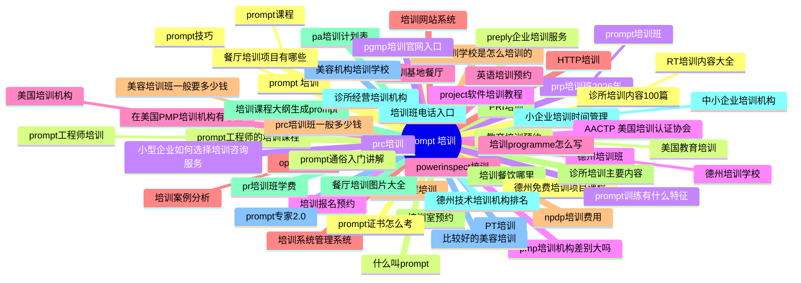

# Topic cluster map — `prompt 培训` (zh)

Generated 2026-09-16 · 60 keywords · 49 clusters · est. 2,579 searches/mo (heuristic)

Legend: **pillar** = cluster head (highest est. volume); satellites hang under it. `KD` 0–100 (lower = easier). `→` target page; `NEW` = no matching page yet.

## Clusters at a glance

| # | Cluster (pillar) | Keywords | Est. vol | Avg KD | Dominant intent | Target |
|---|---|---:|---:|---:|---|---|
| 1 | **prompt 培训** | 3 | 394 | n/a | informational | `/zh/ai-training/` |
| 2 | **prompt工程师的培训课程** | 2 | 125 | n/a | informational | `NEW /zh/prompt-peixun-kecheng/` |
| 3 | **prp培训班2026年** | 2 | 96 | n/a | informational | `NEW /zh/prp-peixun-2026/` |
| 4 | **德州培训班** | 2 | 80 | n/a | informational | `NEW /zh/texas-peixun/` |
| 5 | **在美国PMP培训机构有哪些** | 2 | 80 | n/a | commercial | `NEW /zh/usa-pmp-peixun/` |
| 6 | **opl培训案例** | 2 | 76 | n/a | informational | `NEW /zh/opl-peixun-anli/` |
| 7 | **prc培训班一般多少钱** | 2 | 74 | n/a | transactional | `NEW /zh/prc-peixun-duoshaoqian/` |
| 8 | **PRI培训** | 1 | 71 | n/a | informational | `/zh/ai-training/` |
| 9 | **培训课程大纲生成prompt** | 1 | 71 | n/a | informational | `NEW /zh/peixun-kecheng-prompt/` |
| 10 | **小企业培训时间管理** | 2 | 68 | n/a | informational | `NEW /zh/xiaoqiye-peixun/` |
| 11 | **PT培训** | 1 | 65 | n/a | informational | `/zh/ai-training/` |
| 12 | **诊所培训内容100篇** | 2 | 64 | n/a | informational | `NEW /zh/zhensuo-peixun-100/` |
| 13 | **教育培训预约** | 2 | 60 | n/a | transactional | `NEW /zh/peixun-yuyue-3/` |
| 14 | **prc培训** | 1 | 49 | n/a | informational | `/zh/ai-training/` |
| 15 | **培训报名预约** | 1 | 42 | n/a | transactional | `NEW /zh/peixun-yuyue/` |
| 16 | **培训基地餐厅** | 1 | 42 | n/a | informational | `NEW /zh/peixun-canting/` |
| 17 | **培训系统管理系统** | 1 | 42 | n/a | informational | `NEW /zh/peixun-xitong-xitong/` |
| 18 | **美容培训学校是怎么培训的** | 1 | 42 | n/a | informational | `NEW /zh/meirong-peixun-shi-zenme-peixun/` |
| 19 | **培训室预约** | 1 | 38 | n/a | transactional | `NEW /zh/peixun-yuyue-2/` |
| 20 | **pa培训计划表** | 1 | 38 | n/a | informational | `NEW /zh/pa-peixun/` |
| 21 | **诊所经营培训机构** | 1 | 38 | n/a | informational | `NEW /zh/zhensuo-peixun/` |
| 22 | **美容机构培训学校** | 1 | 38 | n/a | informational | `NEW /zh/meirong-peixun/` |
| 23 | **餐厅培训项目有哪些** | 1 | 38 | n/a | commercial | `NEW /zh/canting-peixun/` |
| 24 | **什么叫prompt** | 1 | 38 | n/a | commercial | `NEW /zh/shenme-prompt/` |
| 25 | **pgmp培训官网入口** | 1 | 38 | n/a | navigational | `NEW /zh/pgmp-peixun-guanwang/` |
| 26 | **pmp培训机构差别大吗** | 1 | 38 | n/a | informational | `NEW /zh/pmp-peixun/` |
| 27 | **powerinspect培训** | 1 | 36 | n/a | informational | `/zh/ai-training/` |
| 28 | **培训网站系统** | 1 | 34 | n/a | informational | `NEW /zh/peixun-xitong/` |
| 29 | **预约课程培训** | 1 | 34 | n/a | transactional | `NEW /zh/yuyue-kecheng-peixun/` |
| 30 | **培训餐饮哪里** | 1 | 34 | n/a | informational | `NEW /zh/peixun/` |
| 31 | **pr培训班学费** | 1 | 34 | n/a | informational | `NEW /zh/pr-peixun/` |
| 32 | **培训班电话入口** | 1 | 34 | n/a | informational | `NEW /zh/peixun-dianhua/` |
| 33 | **比较好的美容培训** | 1 | 34 | n/a | commercial | `NEW /zh/hao-meirong-peixun/` |
| 34 | **德州免费培训项目课程** | 1 | 34 | n/a | transactional | `NEW /zh/texas-mianfei-peixun-kecheng/` |
| 35 | **preply企业培训服务** | 1 | 34 | n/a | informational | `NEW /zh/preply-qiye-peixun-fuwu/` |
| 36 | **小型企业如何选择培训咨询服务** | 1 | 34 | n/a | informational | `NEW /zh/qiye-ruhe-peixun-fuwu/` |
| 37 | **AACTP 美国培训认证协会** | 1 | 34 | n/a | informational | `NEW /zh/aactp-usa-peixun/` |
| 38 | **培训programme怎么写** | 1 | 32 | n/a | informational | `/zh/ai-training/` |
| 39 | **HTTP培训** | 1 | 30 | n/a | informational | `/zh/ai-training/` |
| 40 | **npdp培训费用** | 1 | 30 | n/a | transactional | `NEW /zh/npdp-peixun-feiyong/` |
| 41 | **诊所培训主要内容** | 1 | 30 | n/a | informational | `NEW /zh/zhensuo-peixun-2/` |
| 42 | **餐厅培训图片大全** | 1 | 30 | n/a | informational | `NEW /zh/canting-peixun-tupian/` |
| 43 | **德州技术培训机构排名** | 1 | 30 | n/a | commercial | `NEW /zh/texas-peixun-paiming/` |
| 44 | **prompt专家2.0** | 1 | 30 | n/a | commercial | `NEW /zh/prompt2-0/` |
| 45 | **prompt证书怎么考** | 1 | 30 | n/a | informational | `NEW /zh/prompt-zenme/` |
| 46 | **prompt通俗入门讲解** | 1 | 30 | n/a | informational | `NEW /zh/prompt-rumen/` |
| 47 | **prompt训练有什么特征** | 1 | 30 | n/a | commercial | `NEW /zh/prompt-shenme/` |
| 48 | **project软件培训教程** | 1 | 30 | n/a | informational | `NEW /zh/project-ruanjian-peixun-jiaocheng/` |
| 49 | **英语培训预约** | 1 | 26 | n/a | transactional | `NEW /zh/peixun-yuyue-4/` |

## Pillar → satellite tree

- **prompt 培训** · vol 300 · KD n/a · informational → `/zh/ai-training/`
  - prompt课程 · vol 60 · KD n/a · informational
  - prompt技巧 · vol 34 · KD n/a · commercial

- **prompt工程师的培训课程** · vol 65 · KD n/a · informational → `NEW /zh/prompt-peixun-kecheng/`
  - prompt工程师培训 · vol 60 · KD n/a · informational

- **prp培训班2026年** · vol 54 · KD n/a · informational → `NEW /zh/prp-peixun-2026/`
  - prompt培训班 · vol 42 · KD n/a · informational

- **德州培训班** · vol 42 · KD n/a · informational → `NEW /zh/texas-peixun/`
  - 德州培训学校 · vol 38 · KD n/a · informational

- **在美国PMP培训机构有哪些** · vol 42 · KD n/a · commercial → `NEW /zh/usa-pmp-peixun/`
  - 美国培训机构 · vol 38 · KD n/a · informational

- **opl培训案例** · vol 42 · KD n/a · informational → `NEW /zh/opl-peixun-anli/`
  - 培训案例分析 · vol 34 · KD n/a · informational

- **prc培训班一般多少钱** · vol 44 · KD n/a · transactional → `NEW /zh/prc-peixun-duoshaoqian/`
  - 美容培训班一般要多少钱 · vol 30 · KD n/a · transactional

- **PRI培训** · vol 71 · KD n/a · informational → `/zh/ai-training/`

- **培训课程大纲生成prompt** · vol 71 · KD n/a · informational → `NEW /zh/peixun-kecheng-prompt/`

- **小企业培训时间管理** · vol 38 · KD n/a · informational → `NEW /zh/xiaoqiye-peixun/`
  - 中小企业培训机构 · vol 30 · KD n/a · informational

- **PT培训** · vol 65 · KD n/a · informational → `/zh/ai-training/`

- **诊所培训内容100篇** · vol 34 · KD n/a · informational → `NEW /zh/zhensuo-peixun-100/`
  - RT培训内容大全 · vol 30 · KD n/a · informational

- **教育培训预约** · vol 30 · KD n/a · transactional → `NEW /zh/peixun-yuyue-3/`
  - 美国教育培训 · vol 30 · KD n/a · informational

- **prc培训** · vol 49 · KD n/a · informational → `/zh/ai-training/`

- **培训报名预约** · vol 42 · KD n/a · transactional → `NEW /zh/peixun-yuyue/`

- **培训基地餐厅** · vol 42 · KD n/a · informational → `NEW /zh/peixun-canting/`

- **培训系统管理系统** · vol 42 · KD n/a · informational → `NEW /zh/peixun-xitong-xitong/`

- **美容培训学校是怎么培训的** · vol 42 · KD n/a · informational → `NEW /zh/meirong-peixun-shi-zenme-peixun/`

- **培训室预约** · vol 38 · KD n/a · transactional → `NEW /zh/peixun-yuyue-2/`

- **pa培训计划表** · vol 38 · KD n/a · informational → `NEW /zh/pa-peixun/`

- **诊所经营培训机构** · vol 38 · KD n/a · informational → `NEW /zh/zhensuo-peixun/`

- **美容机构培训学校** · vol 38 · KD n/a · informational → `NEW /zh/meirong-peixun/`

- **餐厅培训项目有哪些** · vol 38 · KD n/a · commercial → `NEW /zh/canting-peixun/`

- **什么叫prompt** · vol 38 · KD n/a · commercial → `NEW /zh/shenme-prompt/`

- **pgmp培训官网入口** · vol 38 · KD n/a · navigational → `NEW /zh/pgmp-peixun-guanwang/`

- **pmp培训机构差别大吗** · vol 38 · KD n/a · informational → `NEW /zh/pmp-peixun/`

- **powerinspect培训** · vol 36 · KD n/a · informational → `/zh/ai-training/`

- **培训网站系统** · vol 34 · KD n/a · informational → `NEW /zh/peixun-xitong/`

- **预约课程培训** · vol 34 · KD n/a · transactional → `NEW /zh/yuyue-kecheng-peixun/`

- **培训餐饮哪里** · vol 34 · KD n/a · informational → `NEW /zh/peixun/`

- **pr培训班学费** · vol 34 · KD n/a · informational → `NEW /zh/pr-peixun/`

- **培训班电话入口** · vol 34 · KD n/a · informational → `NEW /zh/peixun-dianhua/`

- **比较好的美容培训** · vol 34 · KD n/a · commercial → `NEW /zh/hao-meirong-peixun/`

- **德州免费培训项目课程** · vol 34 · KD n/a · transactional → `NEW /zh/texas-mianfei-peixun-kecheng/`

- **preply企业培训服务** · vol 34 · KD n/a · informational → `NEW /zh/preply-qiye-peixun-fuwu/`

- **小型企业如何选择培训咨询服务** · vol 34 · KD n/a · informational → `NEW /zh/qiye-ruhe-peixun-fuwu/`

- **AACTP 美国培训认证协会** · vol 34 · KD n/a · informational → `NEW /zh/aactp-usa-peixun/`

- **培训programme怎么写** · vol 32 · KD n/a · informational → `/zh/ai-training/`

- **HTTP培训** · vol 30 · KD n/a · informational → `/zh/ai-training/`

- **npdp培训费用** · vol 30 · KD n/a · transactional → `NEW /zh/npdp-peixun-feiyong/`

- **诊所培训主要内容** · vol 30 · KD n/a · informational → `NEW /zh/zhensuo-peixun-2/`

- **餐厅培训图片大全** · vol 30 · KD n/a · informational → `NEW /zh/canting-peixun-tupian/`

- **德州技术培训机构排名** · vol 30 · KD n/a · commercial → `NEW /zh/texas-peixun-paiming/`

- **prompt专家2.0** · vol 30 · KD n/a · commercial → `NEW /zh/prompt2-0/`

- **prompt证书怎么考** · vol 30 · KD n/a · informational → `NEW /zh/prompt-zenme/`

- **prompt通俗入门讲解** · vol 30 · KD n/a · informational → `NEW /zh/prompt-rumen/`

- **prompt训练有什么特征** · vol 30 · KD n/a · commercial → `NEW /zh/prompt-shenme/`

- **project软件培训教程** · vol 30 · KD n/a · informational → `NEW /zh/project-ruanjian-peixun-jiaocheng/`

- **英语培训预约** · vol 26 · KD n/a · transactional → `NEW /zh/peixun-yuyue-4/`

## Pages to create

- `/zh/aactp-usa-peixun/` — 1 keywords: AACTP 美国培训认证协会
- `/zh/canting-peixun-tupian/` — 1 keywords: 餐厅培训图片大全
- `/zh/canting-peixun/` — 1 keywords: 餐厅培训项目有哪些
- `/zh/hao-meirong-peixun/` — 1 keywords: 比较好的美容培训
- `/zh/meirong-peixun-shi-zenme-peixun/` — 1 keywords: 美容培训学校是怎么培训的
- `/zh/meirong-peixun/` — 1 keywords: 美容机构培训学校
- `/zh/npdp-peixun-feiyong/` — 1 keywords: npdp培训费用
- `/zh/opl-peixun-anli/` — 2 keywords: opl培训案例, 培训案例分析
- `/zh/pa-peixun/` — 1 keywords: pa培训计划表
- `/zh/peixun-canting/` — 1 keywords: 培训基地餐厅
- `/zh/peixun-dianhua/` — 1 keywords: 培训班电话入口
- `/zh/peixun-kecheng-prompt/` — 1 keywords: 培训课程大纲生成prompt
- `/zh/peixun-xitong-xitong/` — 1 keywords: 培训系统管理系统
- `/zh/peixun-xitong/` — 1 keywords: 培训网站系统
- `/zh/peixun-yuyue-2/` — 1 keywords: 培训室预约
- `/zh/peixun-yuyue-3/` — 2 keywords: 教育培训预约, 美国教育培训
- `/zh/peixun-yuyue-4/` — 1 keywords: 英语培训预约
- `/zh/peixun-yuyue/` — 1 keywords: 培训报名预约
- `/zh/peixun/` — 1 keywords: 培训餐饮哪里
- `/zh/pgmp-peixun-guanwang/` — 1 keywords: pgmp培训官网入口
- `/zh/pmp-peixun/` — 1 keywords: pmp培训机构差别大吗
- `/zh/pr-peixun/` — 1 keywords: pr培训班学费
- `/zh/prc-peixun-duoshaoqian/` — 2 keywords: prc培训班一般多少钱, 美容培训班一般要多少钱
- `/zh/preply-qiye-peixun-fuwu/` — 1 keywords: preply企业培训服务
- `/zh/project-ruanjian-peixun-jiaocheng/` — 1 keywords: project软件培训教程
- `/zh/prompt-peixun-kecheng/` — 2 keywords: prompt工程师的培训课程, prompt工程师培训
- `/zh/prompt-rumen/` — 1 keywords: prompt通俗入门讲解
- `/zh/prompt-shenme/` — 1 keywords: prompt训练有什么特征
- `/zh/prompt-zenme/` — 1 keywords: prompt证书怎么考
- `/zh/prompt2-0/` — 1 keywords: prompt专家2.0
- `/zh/prp-peixun-2026/` — 2 keywords: prp培训班2026年, prompt培训班
- `/zh/qiye-ruhe-peixun-fuwu/` — 1 keywords: 小型企业如何选择培训咨询服务
- `/zh/shenme-prompt/` — 1 keywords: 什么叫prompt
- `/zh/texas-mianfei-peixun-kecheng/` — 1 keywords: 德州免费培训项目课程
- `/zh/texas-peixun-paiming/` — 1 keywords: 德州技术培训机构排名
- `/zh/texas-peixun/` — 2 keywords: 德州培训班, 德州培训学校
- `/zh/usa-pmp-peixun/` — 2 keywords: 在美国PMP培训机构有哪些, 美国培训机构
- `/zh/xiaoqiye-peixun/` — 2 keywords: 小企业培训时间管理, 中小企业培训机构
- `/zh/yuyue-kecheng-peixun/` — 1 keywords: 预约课程培训
- `/zh/zhensuo-peixun-100/` — 2 keywords: 诊所培训内容100篇, RT培训内容大全
- `/zh/zhensuo-peixun-2/` — 1 keywords: 诊所培训主要内容
- `/zh/zhensuo-peixun/` — 1 keywords: 诊所经营培训机构

## Mindmap (Mermaid)

