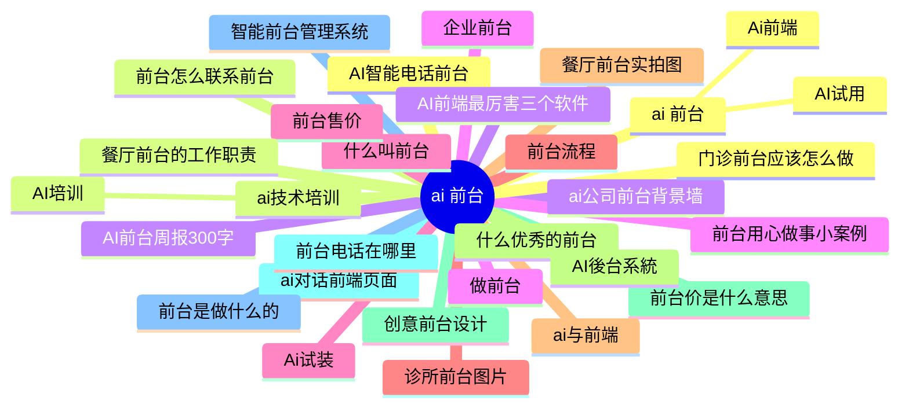

# Topic cluster map — `ai 前台` (zh)

Generated 2026-09-16 · 30 keywords · 27 clusters · est. 1,299 searches/mo (heuristic)

Legend: **pillar** = cluster head (highest est. volume); satellites hang under it. `KD` 0–100 (lower = easier). `→` target page; `NEW` = no matching page yet.

## Clusters at a glance

| # | Cluster (pillar) | Keywords | Est. vol | Avg KD | Dominant intent | Target |
|---|---|---:|---:|---:|---|---|
| 1 | **ai 前台** | 3 | 330 | n/a | commercial | `/zh/ai-receptionist/` |
| 2 | **ai技术培训** | 2 | 70 | n/a | informational | `/zh/ai-training/` |
| 3 | **AI前台周报300字** | 1 | 67 | n/a | informational | `/zh/ai-receptionist/` |
| 4 | **企业前台** | 1 | 37 | n/a | commercial | `NEW /zh/qiye-qiantai/` |
| 5 | **什么叫前台** | 1 | 37 | n/a | commercial | `/zh/ai-receptionist/` |
| 6 | **诊所前台图片** | 1 | 37 | n/a | informational | `NEW /zh/zhensuo-qiantai-tupian/` |
| 7 | **餐厅前台实拍图** | 1 | 37 | n/a | commercial | `NEW /zh/canting-qiantai/` |
| 8 | **什么优秀的前台** | 1 | 37 | n/a | commercial | `/zh/case-studies/ai-man-jack/` |
| 9 | **前台价是什么意思** | 1 | 37 | n/a | informational | `/zh/pricing/` |
| 10 | **ai对话前端页面** | 1 | 37 | n/a | commercial | `NEW /zh/ai/` |
| 11 | **智能前台管理系统** | 1 | 37 | n/a | commercial | `NEW /zh/zhineng-qiantai-xitong/` |
| 12 | **AI智能电话前台** | 1 | 37 | n/a | commercial | `/zh/ai-receptionist/` |
| 13 | **前台怎么联系前台** | 1 | 37 | n/a | informational | `/zh/ai-receptionist/` |
| 14 | **ai公司前台背景墙** | 1 | 37 | n/a | commercial | `/zh/ai-receptionist/` |
| 15 | **前台用心做事小案例** | 1 | 37 | n/a | informational | `NEW /zh/qiantai-yong-zuo-anli/` |
| 16 | **前台售价** | 1 | 33 | n/a | commercial | `NEW /zh/qiantai/` |
| 17 | **前台流程** | 1 | 33 | n/a | informational | `NEW /zh/qiantai-2/` |
| 18 | **ai与前端** | 1 | 33 | n/a | commercial | `/zh/ai-receptionist/` |
| 19 | **AI後台系統** | 1 | 33 | n/a | commercial | `NEW /zh/ai-2/` |
| 20 | **创意前台设计** | 1 | 33 | n/a | informational | `NEW /zh/qiantai-sheji/` |
| 21 | **前台电话在哪里** | 1 | 33 | n/a | commercial | `NEW /zh/qiantai-dianhua/` |
| 22 | **前台是做什么的** | 1 | 33 | n/a | commercial | `/zh/ai-receptionist/` |
| 23 | **门诊前台应该怎么做** | 1 | 33 | n/a | informational | `NEW /zh/qiantai-zenme-zuo/` |
| 24 | **餐厅前台的工作职责** | 1 | 33 | n/a | commercial | `NEW /zh/canting-qiantai-2/` |
| 25 | **AI前端最厉害三个软件** | 1 | 33 | n/a | commercial | `NEW /zh/ai-ruanjian/` |
| 26 | **做前台** | 1 | 29 | n/a | commercial | `/zh/ai-receptionist/` |
| 27 | **Ai试装** | 1 | 29 | n/a | commercial | `/zh/ai-receptionist/` |

## Pillar → satellite tree

- **ai 前台** · vol 260 · KD n/a · commercial → `/zh/ai-receptionist/`
  - AI试用 · vol 37 · KD n/a · transactional
  - Ai前端 · vol 33 · KD n/a · commercial

- **ai技术培训** · vol 37 · KD n/a · informational → `/zh/ai-training/`
  - AI培训 · vol 33 · KD n/a · informational

- **AI前台周报300字** · vol 67 · KD n/a · informational → `/zh/ai-receptionist/`

- **企业前台** · vol 37 · KD n/a · commercial → `NEW /zh/qiye-qiantai/`

- **什么叫前台** · vol 37 · KD n/a · commercial → `/zh/ai-receptionist/`

- **诊所前台图片** · vol 37 · KD n/a · informational → `NEW /zh/zhensuo-qiantai-tupian/`

- **餐厅前台实拍图** · vol 37 · KD n/a · commercial → `NEW /zh/canting-qiantai/`

- **什么优秀的前台** · vol 37 · KD n/a · commercial → `/zh/case-studies/ai-man-jack/`

- **前台价是什么意思** · vol 37 · KD n/a · informational → `/zh/pricing/`

- **ai对话前端页面** · vol 37 · KD n/a · commercial → `NEW /zh/ai/`

- **智能前台管理系统** · vol 37 · KD n/a · commercial → `NEW /zh/zhineng-qiantai-xitong/`

- **AI智能电话前台** · vol 37 · KD n/a · commercial → `/zh/ai-receptionist/`

- **前台怎么联系前台** · vol 37 · KD n/a · informational → `/zh/ai-receptionist/`

- **ai公司前台背景墙** · vol 37 · KD n/a · commercial → `/zh/ai-receptionist/`

- **前台用心做事小案例** · vol 37 · KD n/a · informational → `NEW /zh/qiantai-yong-zuo-anli/`

- **前台售价** · vol 33 · KD n/a · commercial → `NEW /zh/qiantai/`

- **前台流程** · vol 33 · KD n/a · informational → `NEW /zh/qiantai-2/`

- **ai与前端** · vol 33 · KD n/a · commercial → `/zh/ai-receptionist/`

- **AI後台系統** · vol 33 · KD n/a · commercial → `NEW /zh/ai-2/`

- **创意前台设计** · vol 33 · KD n/a · informational → `NEW /zh/qiantai-sheji/`

- **前台电话在哪里** · vol 33 · KD n/a · commercial → `NEW /zh/qiantai-dianhua/`

- **前台是做什么的** · vol 33 · KD n/a · commercial → `/zh/ai-receptionist/`

- **门诊前台应该怎么做** · vol 33 · KD n/a · informational → `NEW /zh/qiantai-zenme-zuo/`

- **餐厅前台的工作职责** · vol 33 · KD n/a · commercial → `NEW /zh/canting-qiantai-2/`

- **AI前端最厉害三个软件** · vol 33 · KD n/a · commercial → `NEW /zh/ai-ruanjian/`

- **做前台** · vol 29 · KD n/a · commercial → `/zh/ai-receptionist/`

- **Ai试装** · vol 29 · KD n/a · commercial → `/zh/ai-receptionist/`

## Pages to create

- `/zh/ai-2/` — 1 keywords: AI後台系統
- `/zh/ai-ruanjian/` — 1 keywords: AI前端最厉害三个软件
- `/zh/ai/` — 1 keywords: ai对话前端页面
- `/zh/canting-qiantai-2/` — 1 keywords: 餐厅前台的工作职责
- `/zh/canting-qiantai/` — 1 keywords: 餐厅前台实拍图
- `/zh/qiantai-2/` — 1 keywords: 前台流程
- `/zh/qiantai-dianhua/` — 1 keywords: 前台电话在哪里
- `/zh/qiantai-sheji/` — 1 keywords: 创意前台设计
- `/zh/qiantai-yong-zuo-anli/` — 1 keywords: 前台用心做事小案例
- `/zh/qiantai-zenme-zuo/` — 1 keywords: 门诊前台应该怎么做
- `/zh/qiantai/` — 1 keywords: 前台售价
- `/zh/qiye-qiantai/` — 1 keywords: 企业前台
- `/zh/zhensuo-qiantai-tupian/` — 1 keywords: 诊所前台图片
- `/zh/zhineng-qiantai-xitong/` — 1 keywords: 智能前台管理系统

## Mindmap (Mermaid)

